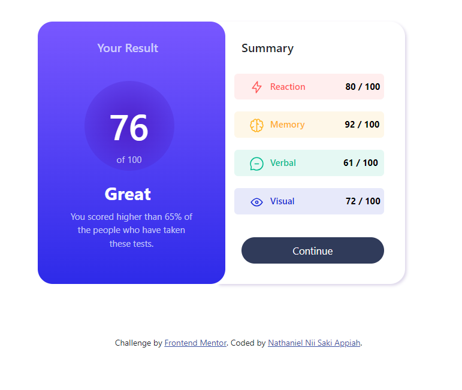

# Frontend Mentor - Results summary component solution

This is a solution to the [Results summary component challenge on Frontend Mentor](https://www.frontendmentor.io/challenges/results-summary-component-CE_K6s0maV). Frontend Mentor challenges help you improve your coding skills by building realistic projects. 

## Table of contents

- [Overview](#overview)
  - [The challenge](#the-challenge)
  - [Screenshot](#screenshot)
  - [Links](#links)
- [My process](#my-process)
  - [Built with](#built-with)
  - [What I learned](#what-i-learned)
  - [Continued development](#continued-development)
  - [Useful resources](#useful-resources)
- [Author](#author)
- [Acknowledgments](#acknowledgments)

## Overview

### The challenge

Users should be able to:

- View the optimal layout for the interface depending on their device's screen size
- See hover and focus states for all interactive elements on the page

### Screenshot

### Links

- Solution URL: [Add solution URL here](https://your-solution-url.com)
- Live Site URL: [Add live site URL here](https://your-live-site-url.com)

## My process

### Built with

- Semantic HTML5 markup
- CSS custom properties
- Flexbox
- CSS Grid
- Bootstrap

### What I learned

In this section i have learnt how to import bootstrap and how to import json lirbary to a code, had a few difficult with my json lirbary but a few researched helped.

### Continued development

After this project am looking forward to gaining more knowledge in JS and its libraries.

### Useful resources

- [W3 School](https://www.w3schhol.com) - This helped me with my basic html tags and css structures.

## Author

- Frontend Mentor - [@RockieSterlin](https://www.frontendmentor.io/profile/yourusername)
- Linkedin - [@Nathaniel Appiah](https://www.twitter.com/yourusername)

## Acknowledgment
A very big thank you to Samuel of Ghana Communication Technology University (GCTU) Ghana

Special thanks goes to the Codetopia community for their help and support.

#challenge-results
